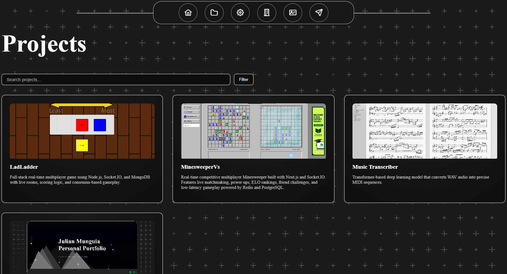
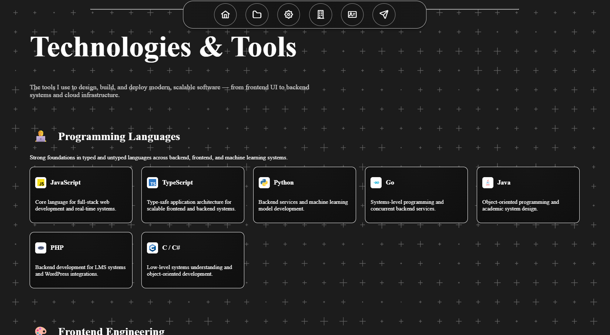
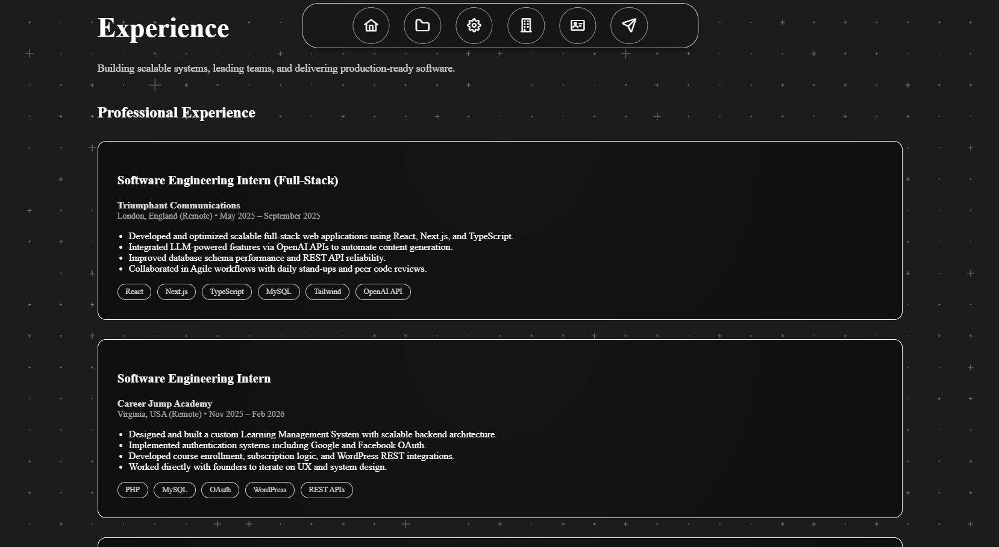
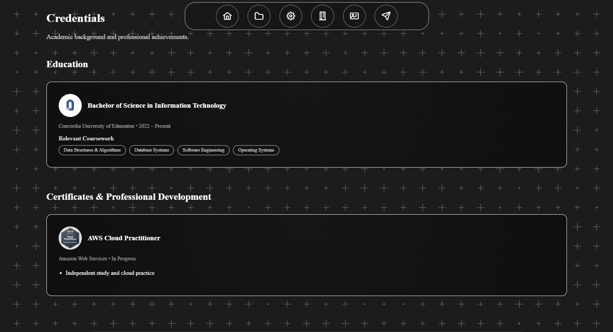
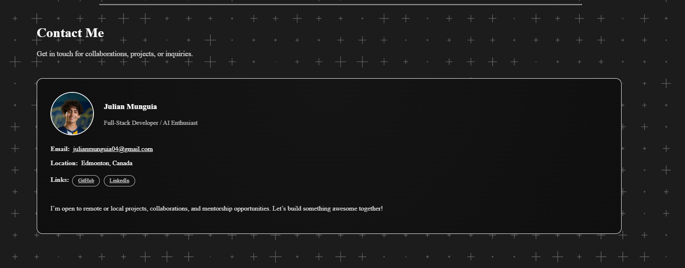

# Personal Portfolio

**Personal Portfolio** is a full-stack web application showcasing my projects, experience, technical skills, and credentials. Built with a modern Vue + Vite frontend and a Node.js + Express backend, the site is deployed and production-ready using Render and SQLite.

---

## 🧰 Tech Stack


---

## 🌐 Features

- Responsive modern UI built with Vue 3 + Vite  
- Backend API powered by Express  
- SQLite database integration  
- Modular component architecture  
- Animated section reveals using IntersectionObserver  
- Dedicated sections for:
  - Home  
  - Projects  
  - Technologies  
  - Experience  
  - Credentials  
  - Contact  
- Production deployment via Render  

---

## 🖼️ Application Screenshots

### Home


### Projects


### Technologies


### Experience


### Credentials


### Contact


---

## 🛠️ Local Setup

Follow these steps to run the portfolio locally.

### 1. Clone the repository

```bash
git clone https://github.com/yourusername/personal_portfolio.git
cd personal_portfolio
```

### 2. Install dependencies (frontend + backend)

```bash
npm run install-all
```

Or manually:

```bash
npm install --prefix backend
npm install --prefix frontend
```

---

### 3. Create Environment Variables

You need environment variables for both backend and frontend.

#### Backend `.env` (inside `/backend`)

```env
PORT=5000
NODE_ENV=development
```

#### Frontend `.env` (inside `/frontend`)

```env
VITE_EXPRESS_API_URL=http://localhost:5000
```

---

### 4. Run Development Mode

```bash
npm run dev
```

This runs both:

- Express backend  
- Vite frontend  

---

### 5. Production Build

To build for production:

```bash
npm run build
```

To start the production server:

```bash
npm start
```

---

## 📦 Project Structure

```
personal_portfolio/
│
├── backend/
│   ├── app.js
│   └── ...
│
├── frontend/
│   ├── src/
│   └── ...
│
├── screenshots/
│   ├── home.png
│   ├── projects.png
│   ├── technologies.png
│   ├── experience.png
│   ├── credentials.png
│   └── contact.png
│
└── package.json
```

---

## 🚀 Deployment

The application is configured for deployment on Render.

- Backend runs as a Node service  
- Frontend is built via Vite  
- SQLite is used as a lightweight production database  
- Environment variables are configured in the Render dashboard  

---

## 📈 Future Improvements

- Admin dashboard for project management  
- Blog integration  
- Enhanced analytics  
- Performance optimization & caching  
- Expanded API functionality  
